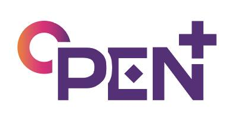
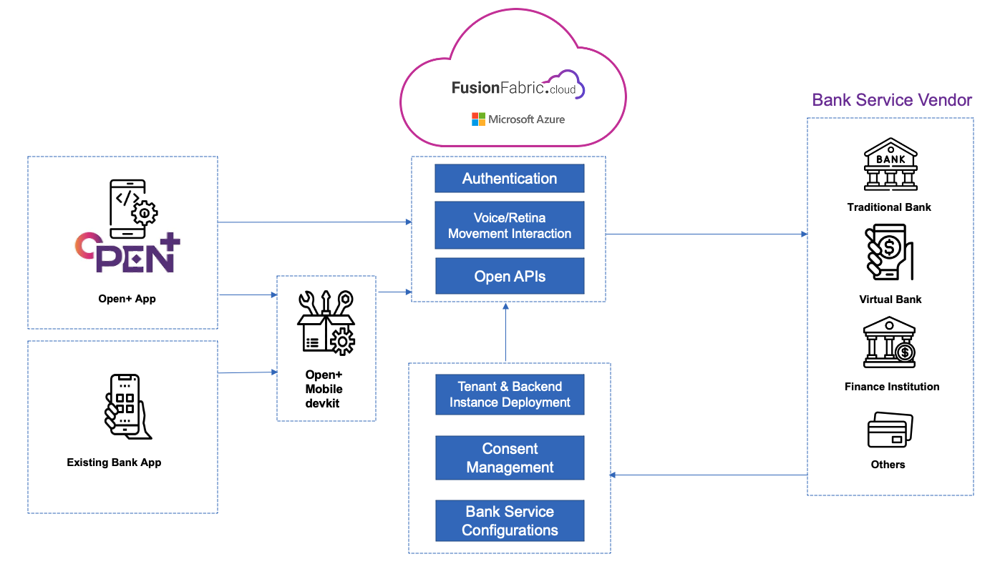
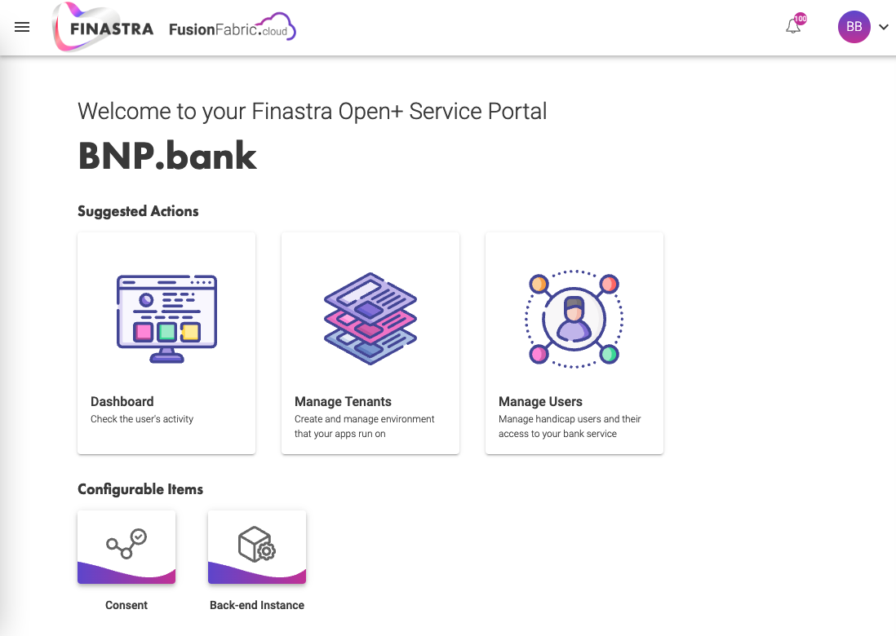

# Open+

An innovation bank application especially for **handicap people**.

In a post-pandemic world, accessibility has emerged as a critical factor for all customers.  

According to the World Health Organization article published in 2021, over **1 billion** people live with some form of disability. For these people, carrying out various banking tasks becomes challenging. 

**We, at Finastra, always strive to make world of finance OPEN, would like to help them with more smoothly bank experience.**

As a next step for fulfilling this case, we would like to take an opportunity to announce our new application with ready-to-integrate devkit, **OPEN+**, 

It is aimed to remove barriers and increase accessibilities of open banking for people with Visual & Hearing Impairment, Speech difficulties, physical impairment, and so on. Thanks to this application, Financial institutions can now offer services to a new group of people who have any kind of impairments.  

Open+ works on top of APIs on Finastra’s **FusionFabric.cloud platform** which can be easily integrated into the most common banking applications, the setup is fast and intuitive for any user.

## More info
[Figma Design file](https://www.figma.com/file/CzHrvNVGyDUd7YdFxD5IwY/OPEN%2B?node-id=0%3A1 
)

[Demo Video]()

## Tech View

### Architecture

The whole architecture is based on the fuionfabric.cloud. As our ambition of finance is to open. We will deploy all API services on FusionFabric.cloud so that every bank vendor can consume it. 

Apart from the API on FusionFabric.cloud, we have our **Open+ Mobile Devkit**, which enable the mobile app with more eye tracking/voice recognition/sign language translate etc.

If bank vendor want to enhance their own app, they can integrate our devkit to enable huge of interactions in their bank app for handicap user. 

If bank vendor doesn't want to spend much time to integrate devkit to their own app, or new bank vendor don't have enough time for it. We provide an app template just like what you can see from the design file. Bank vendor can use our app template directly with some configurations.

What bank service vendor need to do is :
**Just subscribe open+ and make some configurations on our bank service portal then. You can extend their services to handicap users!**

### Bank Service Portal

We provide a [Bank Service portal](https://org-admin.fusionfabric.cloud/) for bank to onboard their applications. Bank admin can manage the users, configuration the client secret to secure their API call from FusionFabric.cloud etc. 

FusionFabric.cloud already have a product called org admin portal, this can be reusable for open+ project. 

The bank can also map the user from bank to FusionFabric.cloud so that the client can log in directly with face or voice without any account number to reduce the complexity for disabled people. And our API and devkit will make sure it works and secure all the operations 
### FusionFabric.cloud API & open+ devkit
Open+ mobile application is made on top of FusionFabric API and devkit. All the request to bank should go through by [FusionFabric Cloud Services](./ffdc-services/README.MD) so the only things the bank need to do is to config and handle the requests properly. Everything behind the scene for example the voice recognition and eye tracking etc, FusionFabric API and devkit will fully handle it. We also have a strict authentication check to secure all the operations. It will be very safe for bank to work with us. Bank vendor doesn't need to work on the complex frontend if they don't want. And also, if they want, they can integrate our API and devkit into their own apps to enhance their bank app's accessibility. 

### Libaray 

 

We won't recreate wheels for eye tracking and voice recognition. We use some libraries such  [Eye tracking solution](https://eyeware.tech/), [Voice recognition solution](https://www.ispeech.org/), [SLAIT](https://slait.ai/) to give us those powers. Furthermore, we encapsulate those tools to create our incredible API and devkit. 